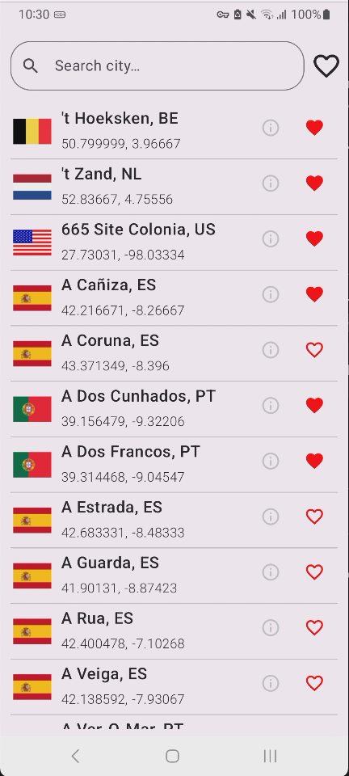
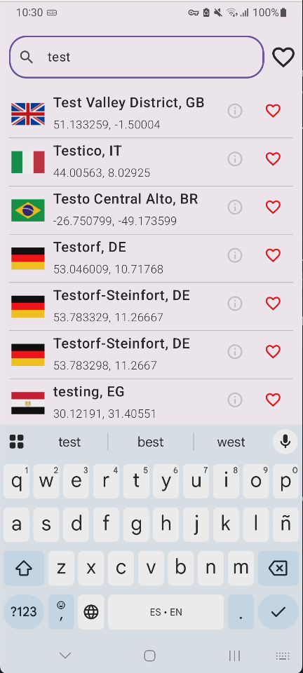
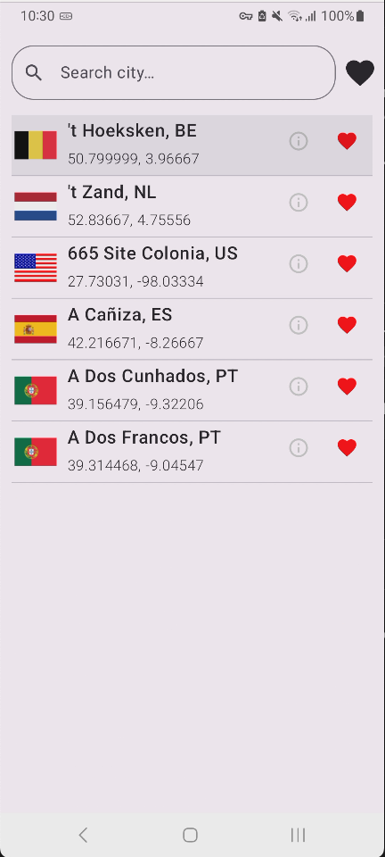
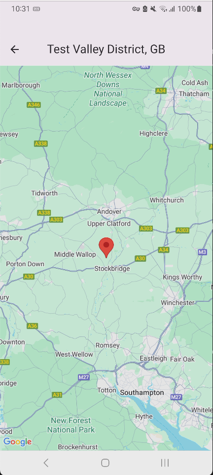
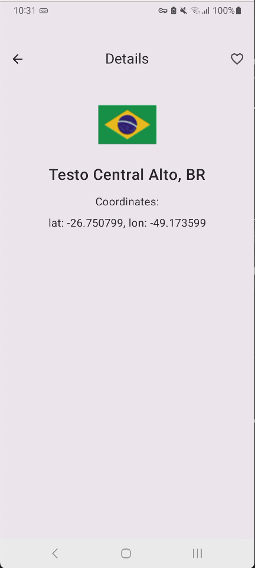
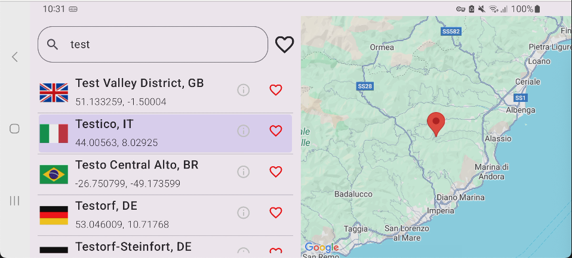

<div align="center"> 

<br></br>
<h1>Cities Search App (Android)</h1> 
<p>Android challenge solution for searching, favoriting, and exploring cities.</p> 
<a href="https://drive.google.com/file/d/1_beIMIpZLhoxWJCd1R7eanBGxH5czz0X/view?usp=sharing">Download a debuggable version from Drive</a>
</div>


## 📱 Feature Overview

🏷 Prefix search: case-insensitive lookup as you type

⭐ Favorites toggle: show all or only starred cities

📦 Paging 3: infinite scrolling for large city lists

💾 Offline-first: Room database backs every query

🗺 Map view: center on city coordinates with Google Maps Compose

## 🏗 Architecture & Module Structure
Followed a modular Clean-Architecture style

- **app** (Android app)
Hosts the NavHost, sets up Koin, ties modules together.

- **core**
    - **domain** (Kotlin)
    Models
    
        *(use-cases were not implemented for this project)*

    - **data** (Android library)
    Room DAOs, Retrofit API, repository implementations.

        *On a bigger project, **:network** and **:database** modules could be extracted*

- **features** Screen UIs, ViewModels, Koin modules for each feature.
    - **city-list** 
    - **city-details**

### DataFlow
```
[UI] <--> [ViewModel] <--> [Repository] <--> [API/Database]
```

## 🧪 Development Process
### 1. TDD-Driven ViewModels
Every ViewModel in this project was born from a failing unit test.

Red - Green - Refactor


### 2. Repository - Data
After the tests passed, the real repository implementation change is made, including any necessary change to the data layer (Network/Database)

### 3. UI - Composables
The composables were made to be small and reusable.
On bigger project, some composables could be extracted to a module to be reusable.


### (Extra) Paging 3 — The Learning Curve
This was the hardest piece since I had to learn how to use it and test it in order to handle 200 K items smoothly when filtering.

## 🏁 Getting Started

1. Clone the repo and open in Android Studio
2. Add your keys to `local.properties`:
```
googleMapsApiKey=YOUR_GOOGLE_MAPS_KEY
```
3. Sync Gradle, then run the app

## 📽️ Screenshots

|City List|City List Search|City List Favs|
|---|---|---|
||||

|City Map|City Detail|City List Landscape|
|---|---|---|
||||
<br>

-----
<br>

Crafted with ❤️ and Kotlin, following best practices in TDD, modularization, and Jetpack Compose.
